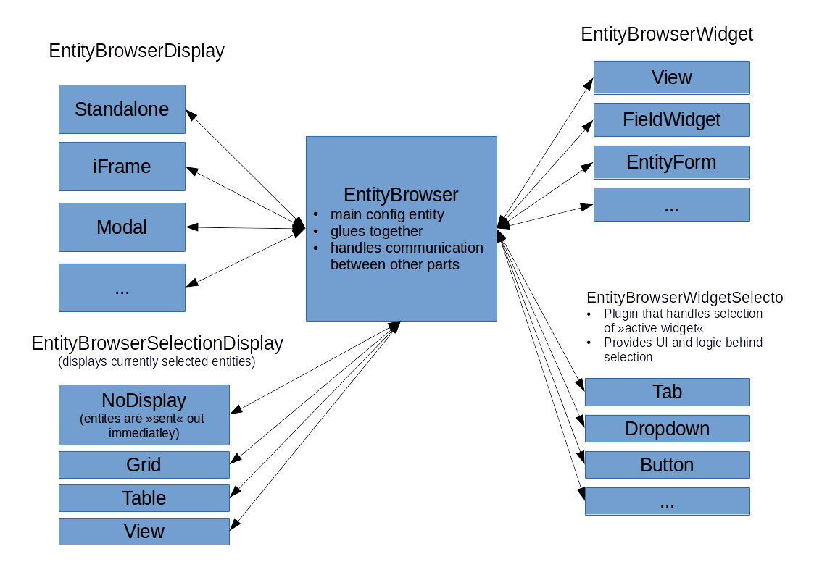
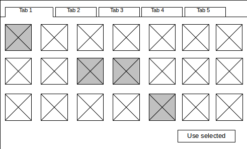
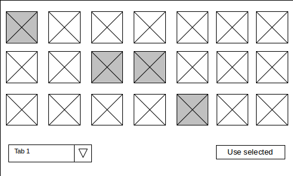
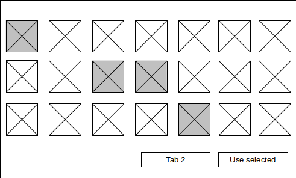
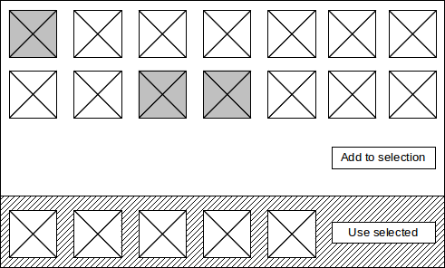
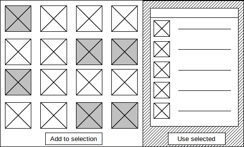
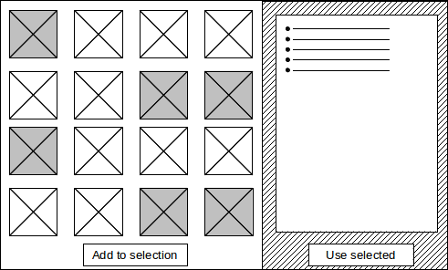

# Architecture

Diagram shows basic architecture of Entity browser.

## Components

- **Entity browser:** Config entity that stores entire configuration for a given EB instance, provides communication interface to other systems, implements any business logic and glues all pieces of the system together.
- **Display:** Plugins that bring EB into different contexts in UI: entity_embed uses modal implementation; a field widget could use EB in an iFrame; a system that pushes content to 3rd party systems could use a standalone form to select entities that need to be pushed over; ...
- **Widget:** Plugins that provide different ways of selecting content (views, custom form, entity form, uploader, field widgets, ...).
- **Widget selector:** Plugins that define how different widgets are displayed and selected. Can be tabs, dropdown, buttons, ...
- **Selection display:** Plugin that handles display and logic around currently selected entities (before they are actually sent over). Can be something as a grid of rendered entities that were selected - allows user to go into different widgets and select entities in multiple steps or something very simple that pushes entities over as soon as something is selected on one of the widgets.

### Widget selectors

Widget selector examples.

#### Tabs widget selector

#### Dropdown widget selector

#### Button widget selector

### Selection displays

#### Grid selection display

#### Table selection display

#### List selection display

