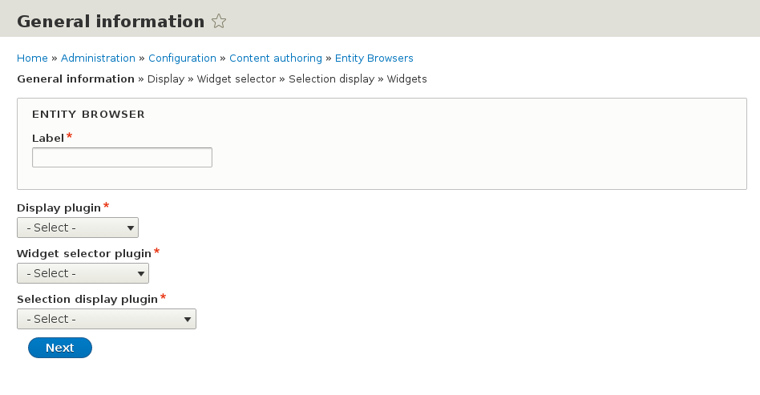
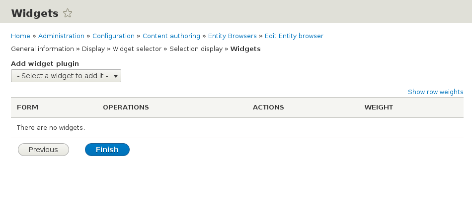
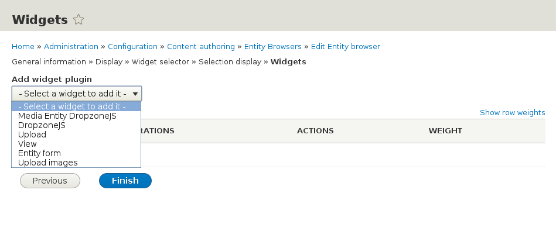
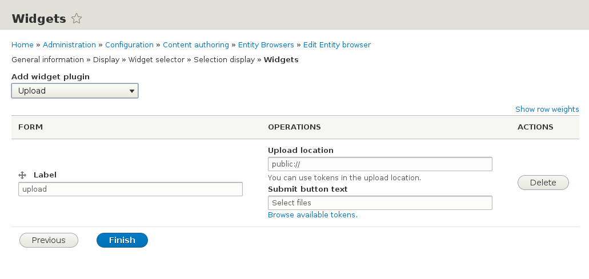

### Creating a Browser with the multi-step Wizard


The Entity Browser module allows the creation of highly configurable browsers through the UI. Also, an overview of the existing browsers is available at the URL:

``` /admin/config/content/entity_browser ```

Make sure you have the permission ```administer entity browsers``` in order to access this page and create / edit the browsers.

In order to create a new Entity Browser, click on **Add Entity Browser** or visit directly the URL ```/admin/config/content/entity_browser/add``` to access the multi-step wizard that will guide you through the process of creating / editing a browser.

Note that, although not required for Entity Browser to work, you need to install the [ctools module](https://www.drupal.org/project/ctools) if you want to be able to use the Wizard and create / edit the browsers using these wizard pages.



On this first step, you will need to indicate the main characteristics of the Entity Browser:
* Give it a Label
* Which [Display](displays.md) plugin to use
* Which [Widget Selector](widget_selectors.md) plugin to use
* Which [Selection Display](selection_displays.md) plugin to use

Depending on the options selected here, the following steps will present different configuration options, specific for each plugin type.
 
The information introduced in the following 3 steps:
* Display
* Widget selector
* Selection display

will be used to configure each of these specific plugins, and you can find more documentation about the options available on each case in the pages of this book dedicated to each plugin type:
* [Displays](displays.md)
* [Widget Selectors](widget_selectors.md)
* [Selection Displays](selection_displays.md)

The last step (**Widgets**) is where you define the widgets you want to include in your browser and their order of appearance (if more than one):



You need to select a widget type on the dropdown **Add widget plugin**. Depending on the modules you have installed, different options may be available on this select list:



After selecting a widget type, a new row is added to the list and you can configure the specific widget settings, if any.



After adding and configuring the widgets you need, you can (optionally) re-order them by dragging the table rows.
Click on **Finish** to conclude the wizard operation and save the Entity Browser.

