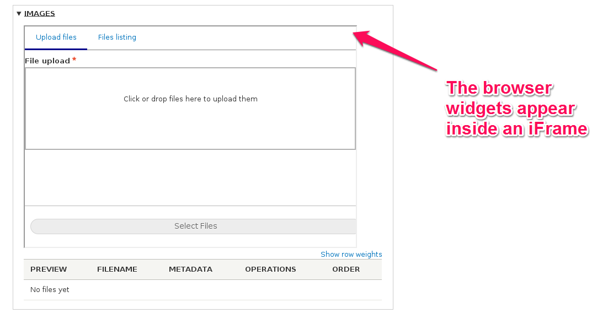
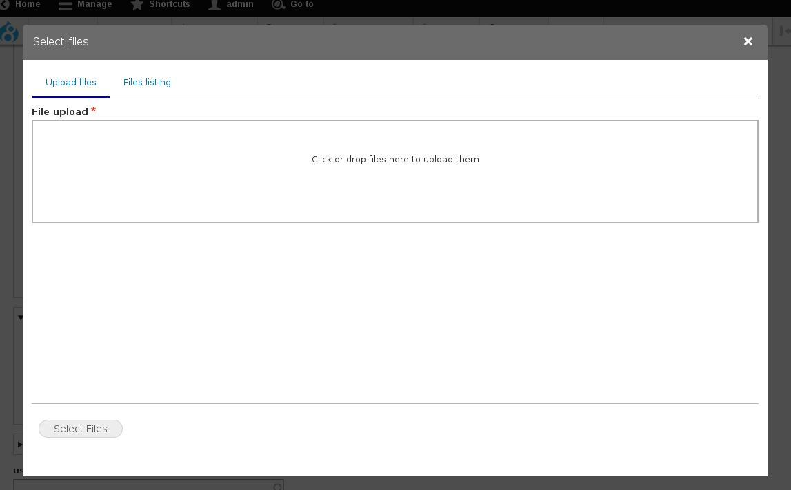

# Displays

**Display** plugins are responsible for presenting the entity browser to the end user (editor), in different contexts. Contrib or custom modules can provide new display plugins or extend existing ones.

The base [Entity Browser](https://drupal.org/project/entity_browser) module provides the following display plugins out of the box:

### iFrame

An entity browser configured to use an **iFrame** type of display will have the browser widgets embedded into the current page, inside an iframe element.

An example of what this configuration defines is shown in the following image:

The standard configuration options for this type are:
- **Width** - The width of the iFrame element
- **Height** - The height of the iFrame element
- **Link text** - The label to use on the display submit button
- **Auto-open** - Whether the display (iframe, modal, etc) should open automatically or if the end user needs to click on a link to launch the display.

### Modal

An entity browser configured to use a **Modal** type of display with load the browser widgets in a modal window, as you can see in the following picture:

The standard configuration options for this type are:
- **Width** - The width of the modal window
- **Height** - The height of the modal window
- **Link text** - The label to use on the display submit button

### Standalone

The **Standalone** display type allows the definition of a specific URL to host the Entity Browser, being accessible independently of other content / entities. This option is quite unlikely to be used in the most common use-cases of media handling, but you might find it useful if you need to build a system that only selects / creates entities for another system (for example a 3rd party content processor) who is the actual responsible for dealing with them.

The only configuration option for this type is:
- **Path** - The URL where the standalone form should be accessible

