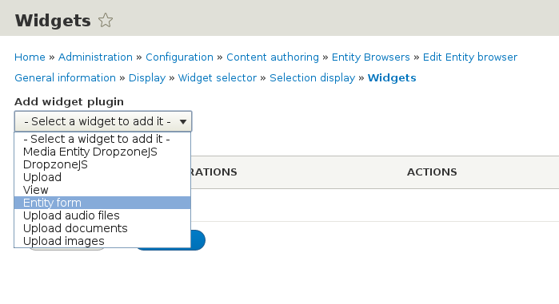
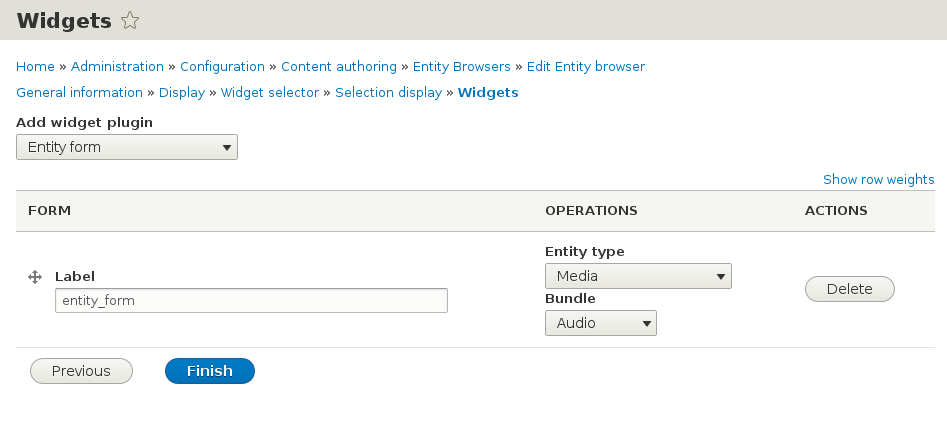
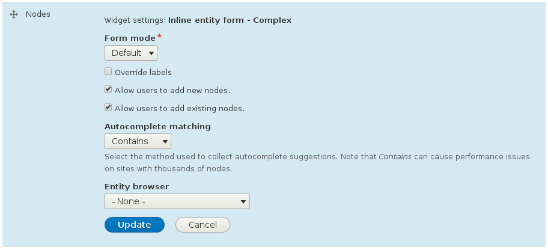

# Inline Entity Form

Entity Browser integrates with the module [Inline Entity Form](https://drupal.org/project/inline_entity_form) (through the **entity_browser_entity_form** submodule). There are two ways the two modules can be combined:
 
## Using Entity Browser to create new entities, as well as browsing the existing ones

Entity Browser comes with an **"Entity form"** widget that uses the **"Inline Entity Form"** form element to build entity creation forms. This allows users to create new entities of any type from inside of an arbitrary entity browser.

To configure this option, [follow the previous instructions](creating_browser_through_ui.md) to create an Entity Browser (or modify an existing one provided by an example module), and configure the widget (last step) the following way:

1- Go to the Widget step on the multi-setp wizard, which will be at the URL:
```/admin/config/content/entity_browser/{your_browser_name}/widgets?js=nojs ```

2- On the dropdown **"Add widget plugin"**, select **"Entity form"**



3- Once the widget is added, go to the corresponding row and configure the entity types and bundles you will allow the users to create using this widget.



In the previous example, when the editor selects this widget on the Entity Browser (by selecting the corresponding tab, dropdown, etc), the form to create a "Media" entity (in the "Audio" bundle) will be presented as an inline form.


## New entities with IEF, but browse existing with Entity Browser

Entity Browser can inject itself into Inline Entity Form and replace standard autocomplete textfield that is used to reference existing entities from IEF.

This allows site builders to create nicer and more powerful experience for content creators. The in-form creation of new entities will keep being handled by the Inline Entity Form, but we are extending it to allow the browsing experience of existing entities to be done through a custom EB widget.

To configure this option, please follow these steps:

1- Go to your entity **"Manage Form Display"** configuration page, where you can configure the widgets of your entity_reference field. For example, if you have the field in the "page" content type, this will be available at the URL: 
```/admin/structure/types/manage/page/form-display```

2- Choose **"Inline entity form - Complex"** as primary widget to your field

3- Click on the gear to open the widget settings:



  Make sure you have the option **"Alow users to add existing {entity_type}"**.
  
4- Select on the dropdown **"Entity Browser"** the browser you want to use as a browsing widget. Note that at this point you will need to have previously created a browser. If you don't have any browser created yet, please refer to the [instructions on creating one](creating_browser_through_ui.md).
