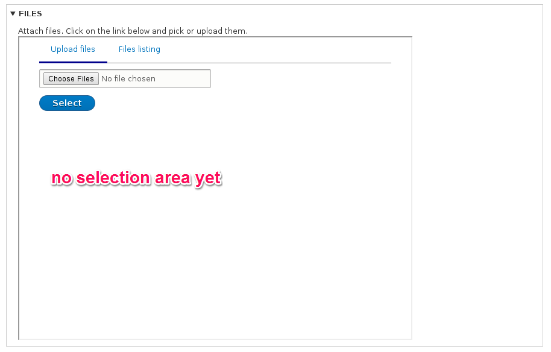
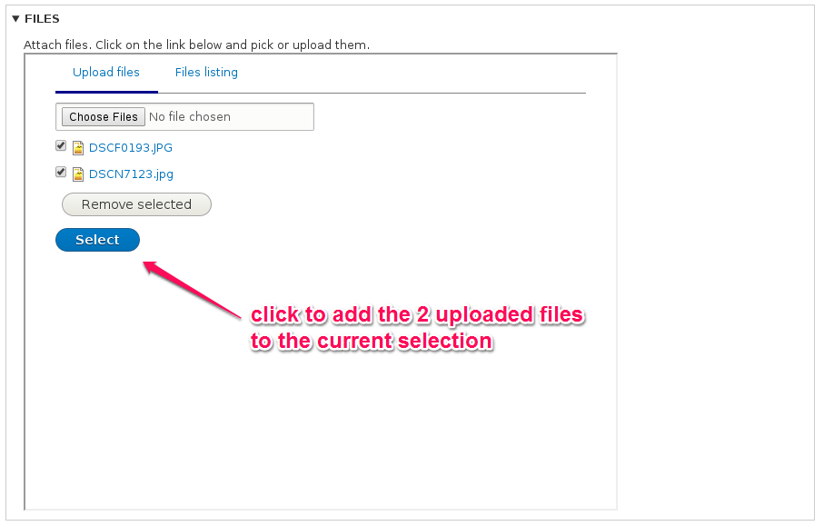
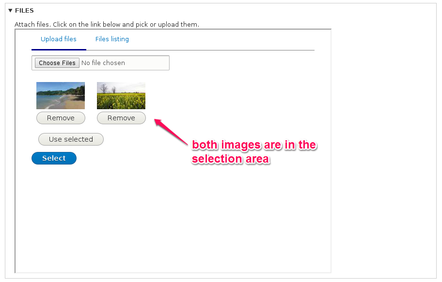
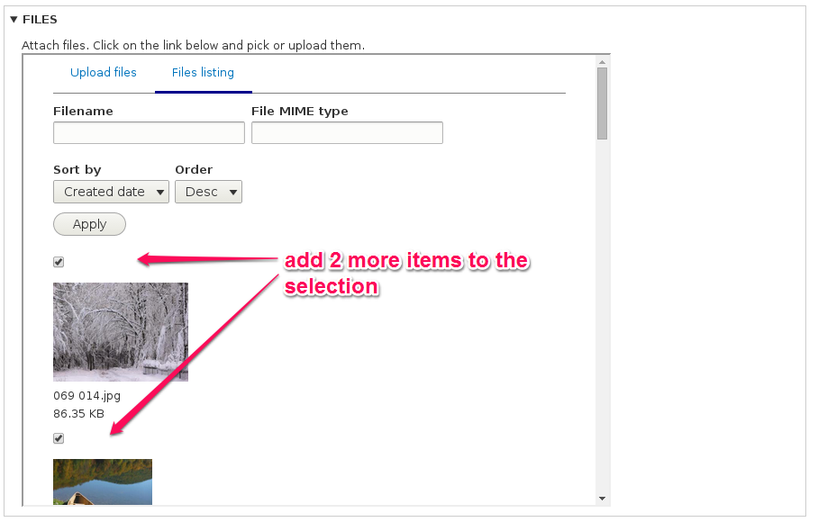
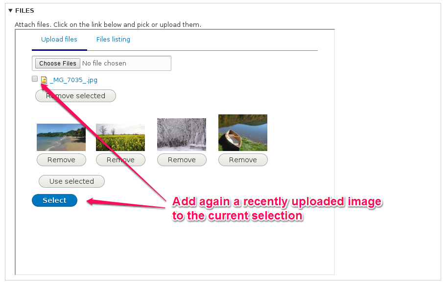
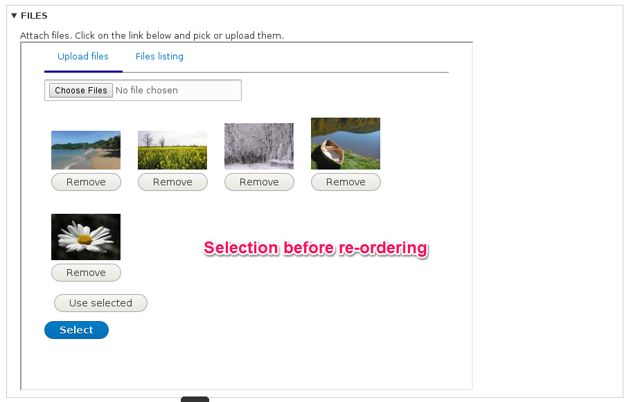
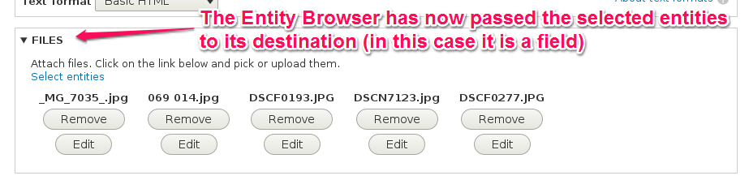

# Selection displays

The **selection display** plugins provide a way for the end user (editor) to deal with the entities that are in process of being selected, but before confirming the operation. You can think of it as a sort of "temporary storage" for the entities that are being "retrieved" by the Entity Browser, while the user is using the browser.

As with the other plugins, contrib and custom modules can extend and provide additional plugins of this type.

The **Entity Browser** module provides the following **selection display** plugins:

### No selection display

This option is the simplest alternative, when you do not want your Entity Browser to provide any mechanism to deal with the temporary "selection area" of the entities being retrieved by the browser.

### Multi-step selection display

This is the option you might want to use in the most flexible or complex media handling workflows. The **multi-step selection display** allows the editor to use different widgets sequentially in order to populate a **selection set** and these entities being selected will be visible in the **selection** area.

This workflow can be better understood in the following images:

1) Nothing is selected, the **selection set** is empty

2) Upload 2 images using the widget, there is now an option to add these 2 to the current selection

3) Add these 2 images to the selection

4) Let's select now some existing images from the media library

5) Let's upload another image with the first widget (upload)

6) We can then manually re-order the selection to suit our needs, if necessary

7) We can finally confirm the operation to use the content of our selection display in our field

The **multi-step** selection display provides the following configuration options:
- **Entity type** - The type of the entity being selected. Not all display plugins will need this, and will be ignored if the display being in charge of displaying it on the selection area do not need this information.
- **Entity display plugin** - The plugin responsible for rendering the visualization of the entity inside the selection area.
- **Select button text** - The label to use on the submit button of the selection area

### View selection display

This type of selection display can use **an arbitrary view** to be used as "selection area", with all the flexibility that a custom-made view can bring to your browser.

The only requirement you need to pay attention to when using this option is that your  view needs to have a Contextual Filter that receives entities IDs, with multiple-valued arguments (for instance: "12,45,22,938") enabled.

There are some known limitations of this display type:
- If a given entity is selected twice, it will be displayed only once.
- The view used as selection display will generally not respect the order of the selected entities.
These are all limitations of the views system, in core.

In order to create an Entity Browser with this type of selection display, the steps to follow are:

1) Create a view that showing entities (or any representation of entities you would need) and make sure that this view is configured to accept as **Contextual Filter** the main ID of the entity (**NID** for nodes, **UID** for users, etc).

2) When creating the Browser through the wizard, select **View selection display** on the dropdown of the first step.

3) Indicate the view and display names in the fourth step of the wizard:
- **View : view display** - The view name and display name to be used to show the entities in the selection area during the selection.

#### Examples of selection displays that could be built with a custom view:

#### Grid

#### Table

#### List

