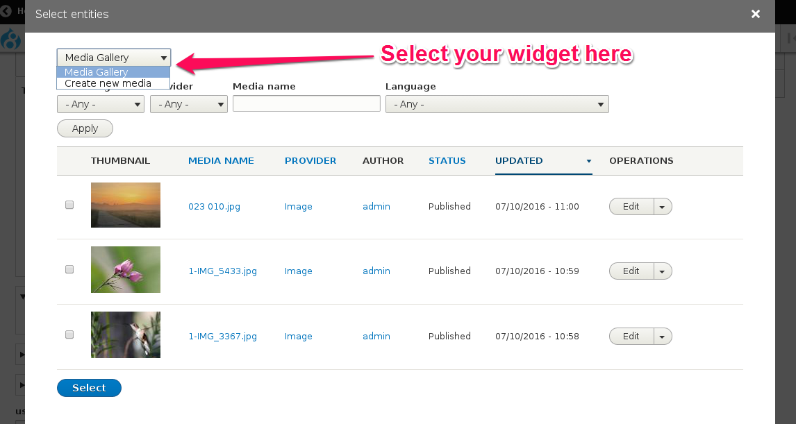
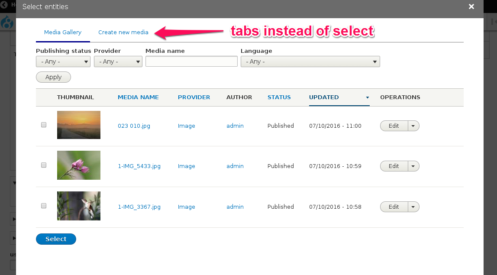

# Widget selectors

The **Widget selector** plugins define how multiple widgets of the same Entity Browser should be presented on the user interface.

For example, a site builder could create an Entity Browser containing 2 widgets: "Media Gallery" (a view) and "Create new media" (an entity form), and the mechanism to change between these two widgets is defined in the **widget selector** plugin configuration.

The [Entity Browser](https://drupal.org/project/entity_browser) base module defines the following **widget selector** plugins:

### Dropdown

### Tabs

### Single widget

When configured to use the **Single widget** selection type, the Entity Browser will show **only the first** of the available widgets, and is naturally suitable for those situations where it makes sense to have only one widget available in the browsing experience.

