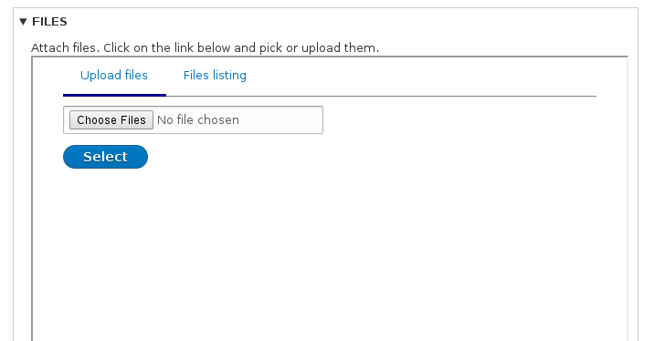
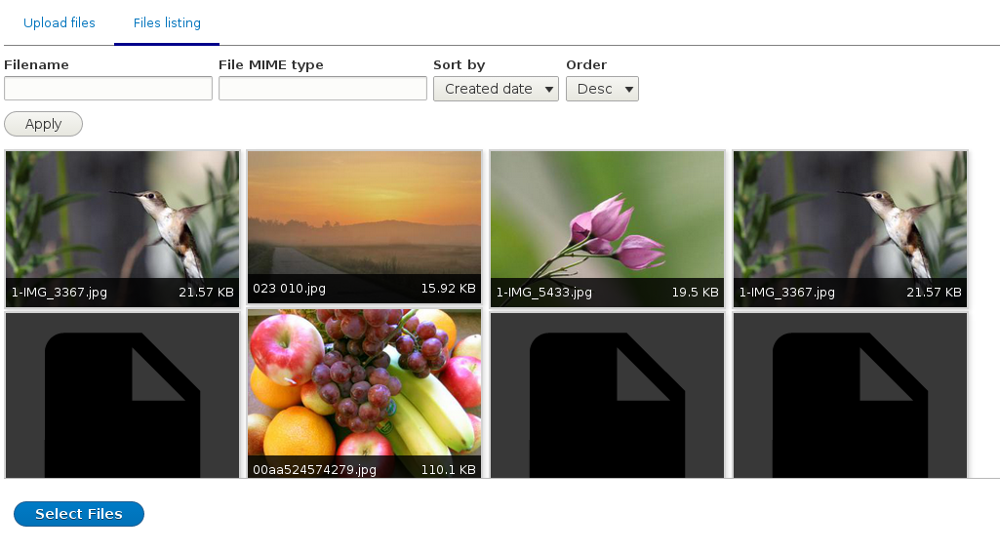

# Widgets

**Widget** plugins represent the main functionality of the Entity Browser, providing a tool for the end user to browse/view/create/select the specific content he/she is looking for. 

The [Entity Browser](https//drupal.org/project/entity_browser) base module provides a set of widget plugins, and contrib / custom modules can extend this list providing additional widgets.

The widgets available on the Entity Browser module out of the box are:

### File Upload

This is the standard file upload widget from drupal.




The only configuration option for this type is:
- **Upload location** - The path where the files will be uploaded to. Defaults to ```public://```


### Views

The **View** widget plugin allows the end user to navigate / browse though an arbitrary view and select a given content from this list of results. The site builder can select which view to use on this widget, and any properly configured view (see the "[creating a browser](creating_browser_through_ui.md)" section for more info) can be used here.




The only configuration option for this type is:
- **View : View display** - The name of the view and display that should be used in this widget


### Entity form (when using the "Entity Browser IEF" submodule)

If you have enabled the module **Entity Browser IEF** then you will be able to use also the **Entity form** widget, which will allow the creation of an arbitrary entity inside the Entity Browser. This widget will open the entity creation form inside the browser, and users can then mix the selection of the existing entities with the creation of new ones in the same "browsing / selecting" operation.

You can find more information about the integration between **Entity Browser** and **Inline Entity Form** on [its specific chapter](inline_entity_form.md) of this guide.


