# Field Formatter

[Field Formatter](https://www.drupal.org/project/field_formatter) module adds formatters for entity reference fields to output only a specific field. This module provides two formatters: *Field formatter with inline settings* and *Field formatter from view display*.

## Installation

1. Download [Field Formatter](https://www.drupal.org/project/field_formatter) from [Drupal.org](https://www.drupal.org/node/2328797/release).
2. Install it in the [usual way](https://www.drupal.org/documentation/install/modules-themes/modules-8).

## Usage

1. Create entity reference field:
  * On `admin/structure` choose **Content types**.

    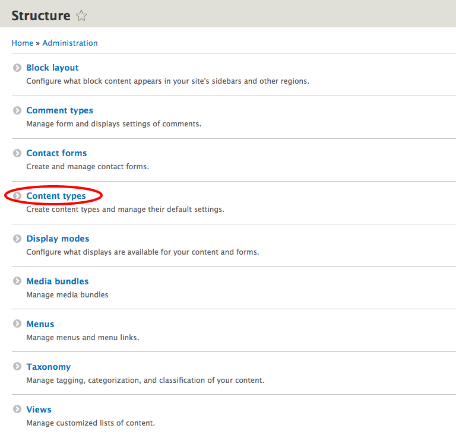
  * Choose content type entity reference field should be added to, for example: *Article*, and click **Manage fields**.

    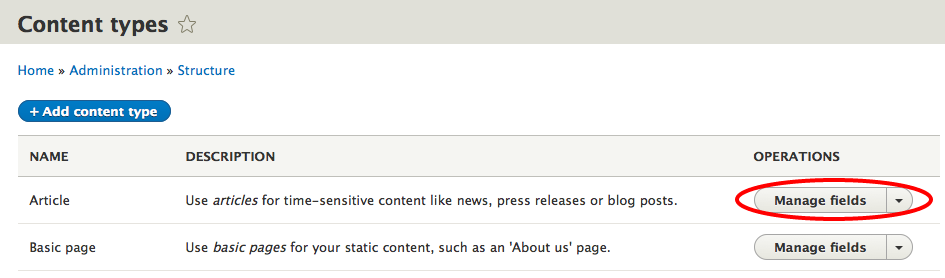
  * Click **+ Add field**.

    
  * From **References** dropdown menu choose **Other**, fill the *Label* and click **Save and continue**.

    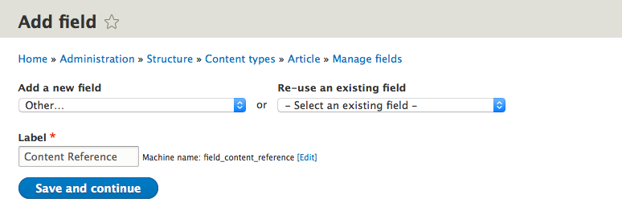
  * Choose **Type of item to reference**, for example: *Content*, and click **Save field settings**.

    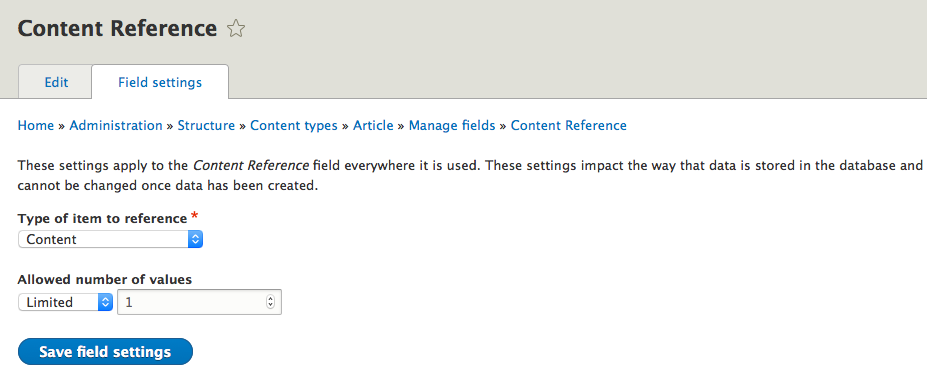
  * Select which content types you want to reference in **Reference type section**, for example: *Article*, and click **Save settings**.

    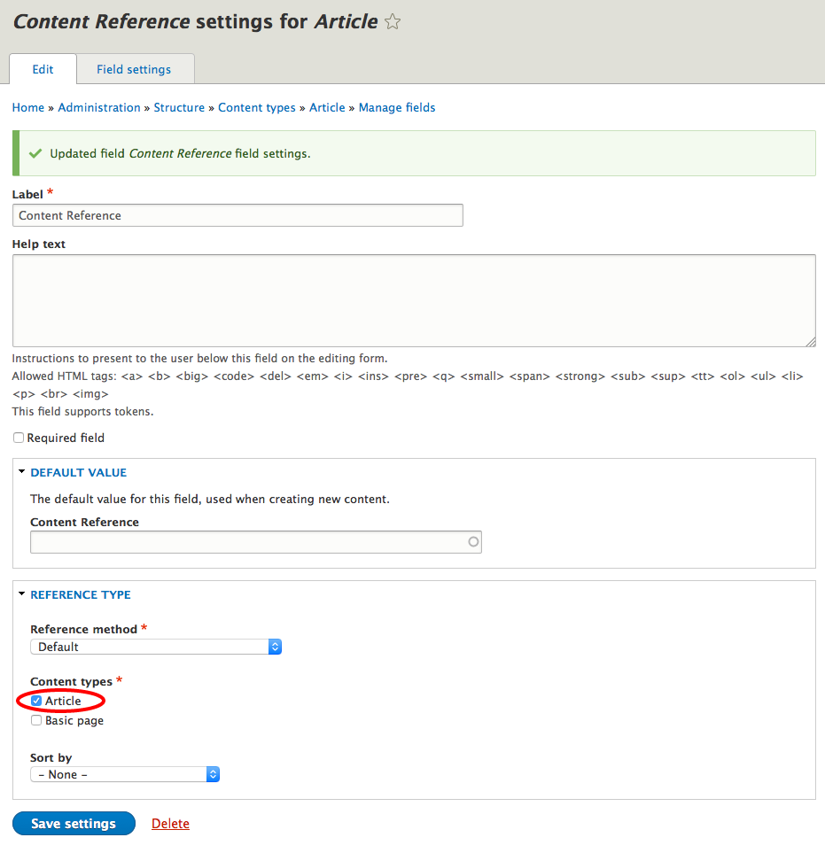
2. Choose field formatter for your entity reference field:
  * Open *Manage display* page for the selected content type (in our case *Article*).

    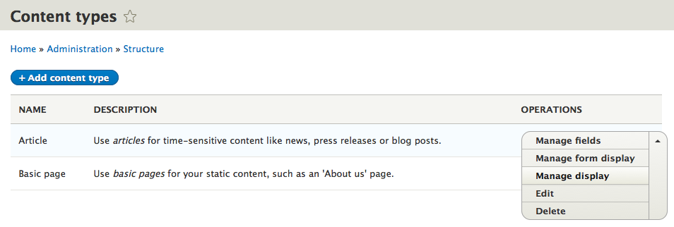
  * Choose which formatter you want to use on your entity reference field, *Field formatter with inline settings* or *Field formatter from view display*.

    
  * In formatter settings define which field from the referenced entity you want to display in your article.

    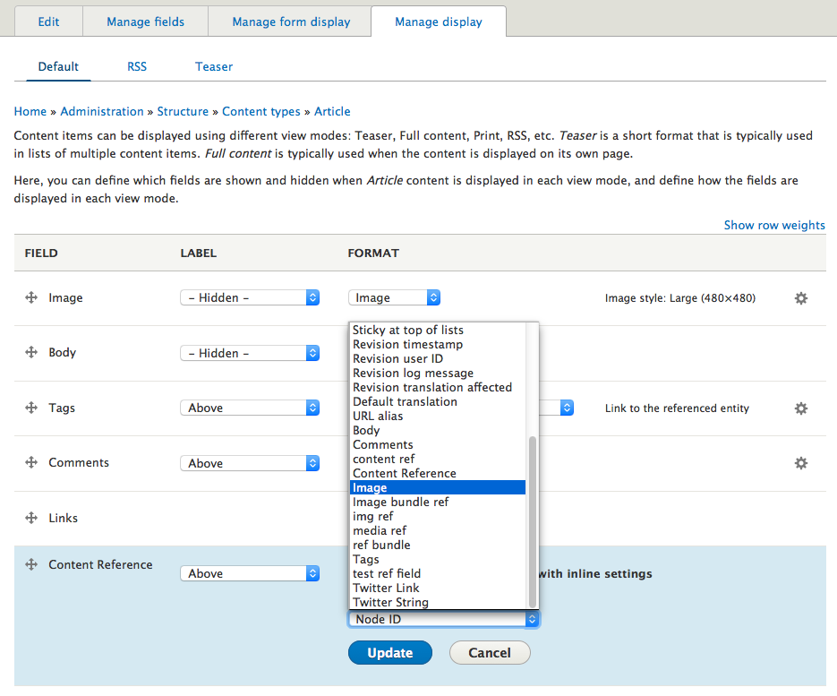
  * You also need to configure View mode if you're using *Field formatter from view display*
  * Click **Update** and then **Save**.

    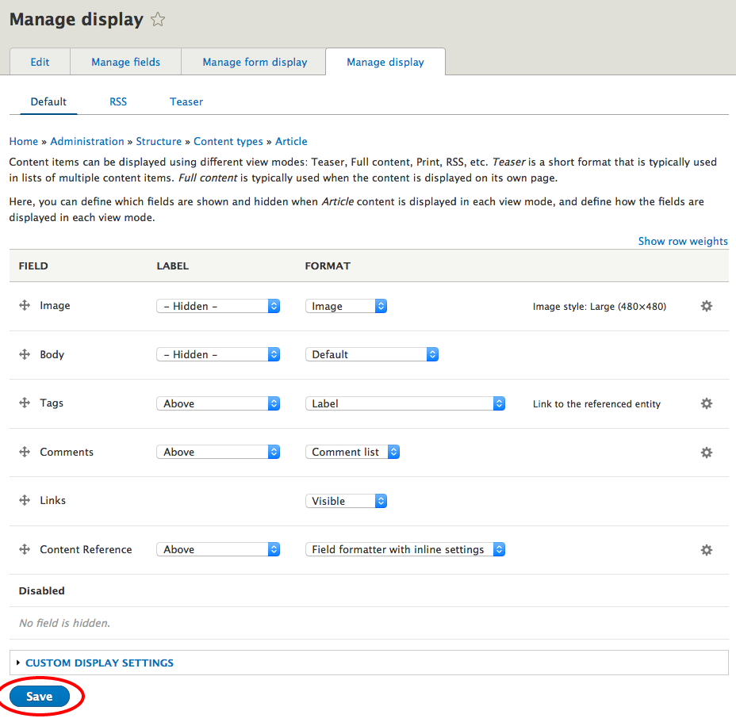
3. Create a new node (in our case *Article*) with entity reference field:
  * In `admin/content` click **+ Add content**.

    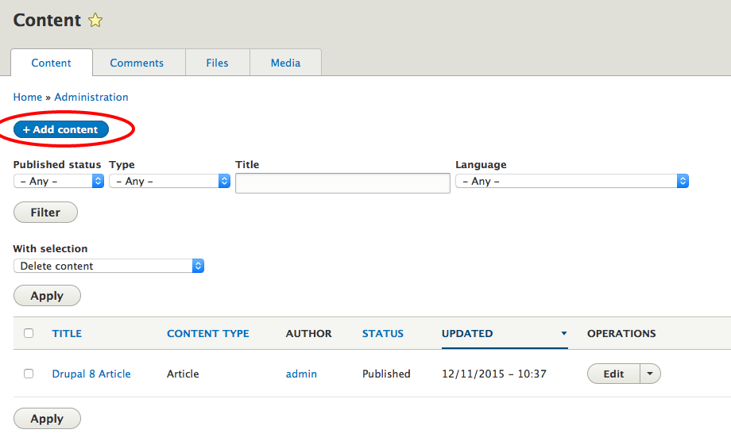
  * Choose node to create (in our case *Article*).

    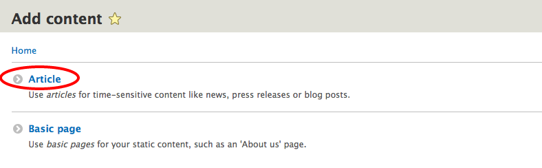
  * Fill *Title* and all the other fields, for your entity reference field choose entity (or in our case *Article*) you want to reference and click **Save and publish**.

    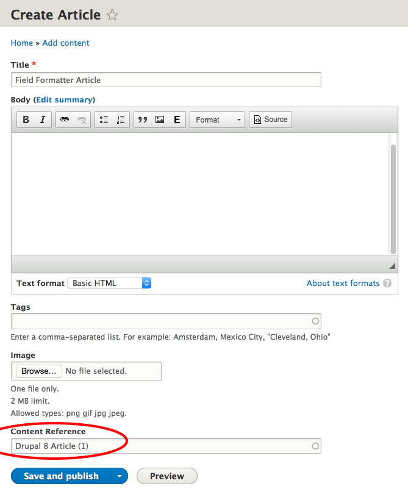
  * The chosen field from referenced entity is displayed on the saved article page.
