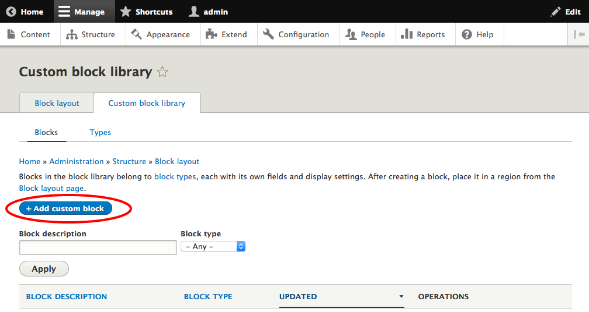
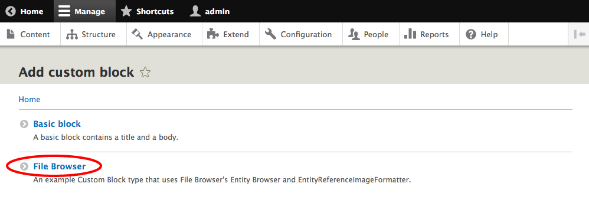
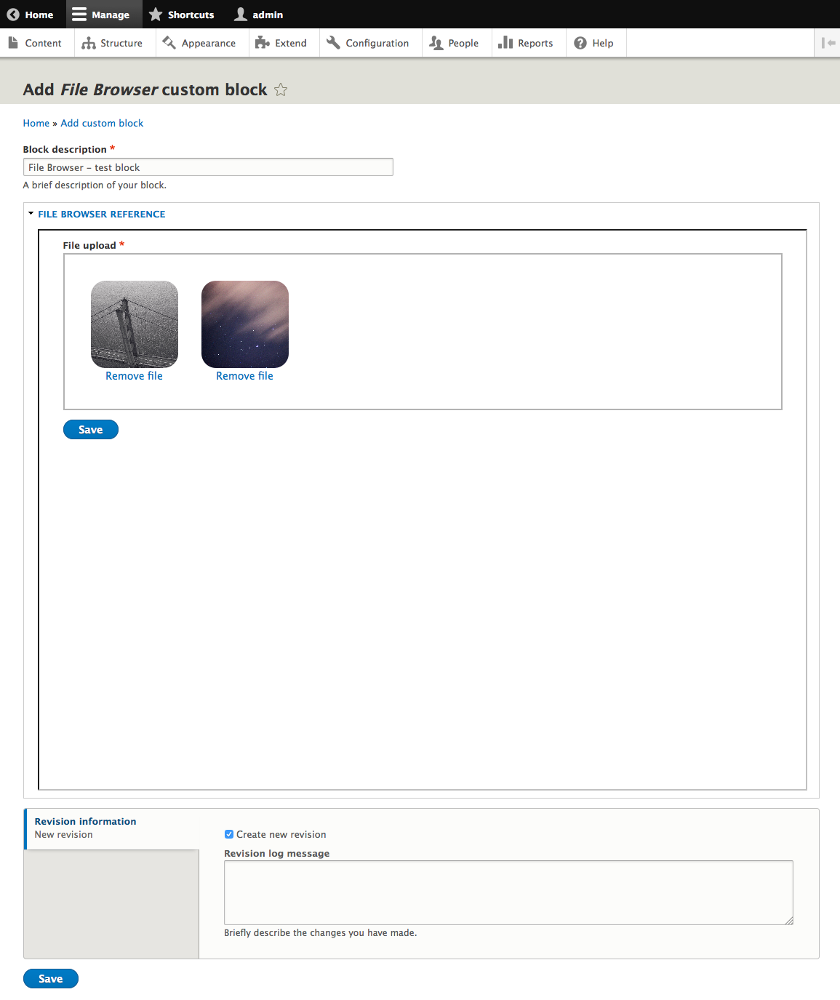

# File Entity Browser

The [File Entity browser](https://www.drupal.org/project/file_browser) module provides a default [Entity Browser](https://www.drupal.org/project/entity_browser) that lets you browse and select your files in a nice-looking, mobile-ready [Masonry](http://masonry.desandro.com/) based interface, and upload files using the [Dropzonejs](https://www.drupal.org/project/dropzonejs) module. This module uses Entity browser to provide nice content creation experience and re-usability of core files.

## Requirements

1. [Entity Browser](https://www.drupal.org/project/entity_browser)
2. [Dropzonejs](https://www.drupal.org/project/dropzonejs)

## Installation 

1. Download [Entity Browser](https://www.drupal.org/project/entity_browser) from Drupal.org.
2. Download [Dropzonejs](https://www.drupal.org/project/dropzonejs) from Drupal.org and follow the install instructions on that page
3. Download [File browser](https://www.drupal.org/node/2600630/release) and run [bower](http://bower.io/) install from the file_browser directory

## Usage

The File Entity browser module creates custom block type with the entity reference field on it. That entity reference field uses entity browser to attach images to that block. It demonstrates how custom blocks work and how entity browser can be used to improve media-related experience.

### Creating File Browser custom block

1. On `/structure/block/block-content` click **+Add custom block**:

  

2. Choose **File Browser** custom block type:

  
 
3. Add desired custom block name and upload files to add to your block and click **Save**:

  

4. At the end just click Save at the bottom of the page and your File Browser custom block is ready to be used on any region from the Block layout page.

## Supporting organizations
- [Acquia](https://www.drupal.org/marketplace/acquia)
