# ImageWidgetCrop module

[ImageWidgetCrop](https://www.drupal.org/sandbox/woprrr/2571403) provides an interface for using the features of the [Crop API](https://www.drupal.org/project/crop). This widget provide an UX for use a crop on all fields images. This module have particularity to purpose capability to crop the same image by 'Crop type' configured. It's very usefull for editorial sites or media management sites.

## Try me

You can Test ImageWidgetCrop in action directly with the sub-module, "ImageWidgetCrop example" to test different usecases of this module.

## Requirements

1. [Crop API](https://www.drupal.org/project/crop)

## Installation

1. Download [Crop API](https://www.drupal.org/node/2376659/release) from Drupal.org.
2. Download [ImageWidgetCrop](https://github.com/woprrr/image_widget_crop) from GitHub.
3. Install both Crop API and ImageWidgetCrop in the [usual way](https://www.drupal.org/documentation/install/modules-themes/modules-8).

## Usage

1. Create a Crop Type
  * On `admin/structure` choose **Crop types**
    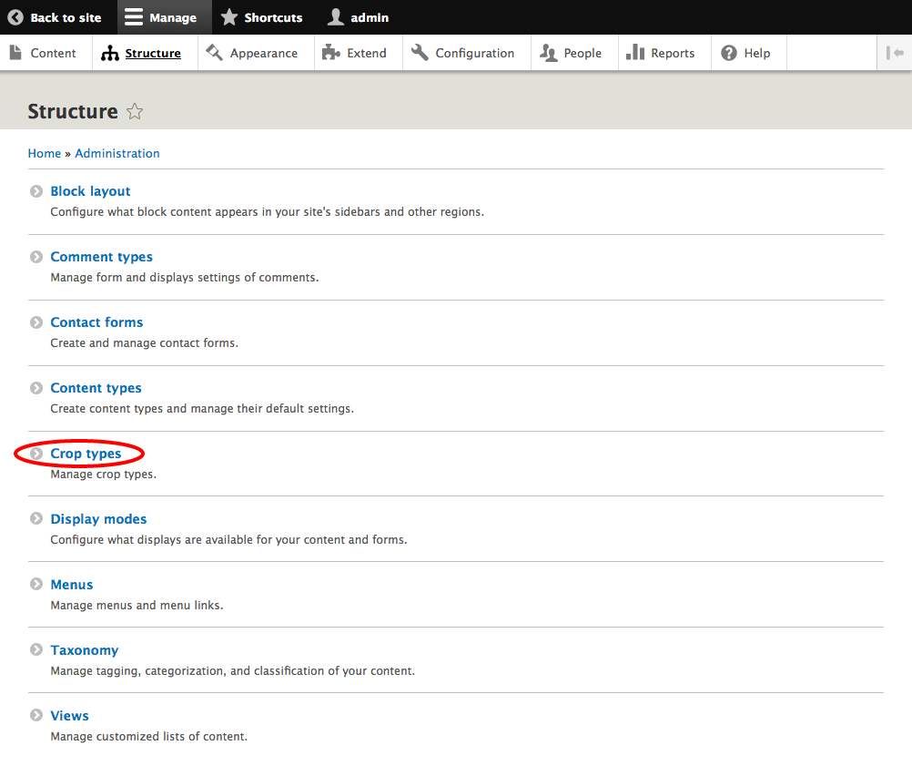
  * Click on **+ Add crop type**
    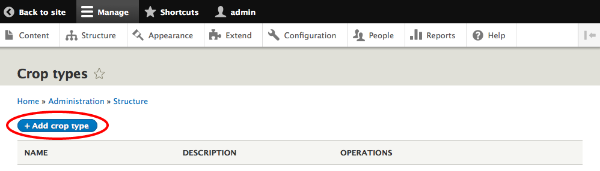
  * Add Name, Description and Aspect Ratio for your crop type and click **Save crop type**
    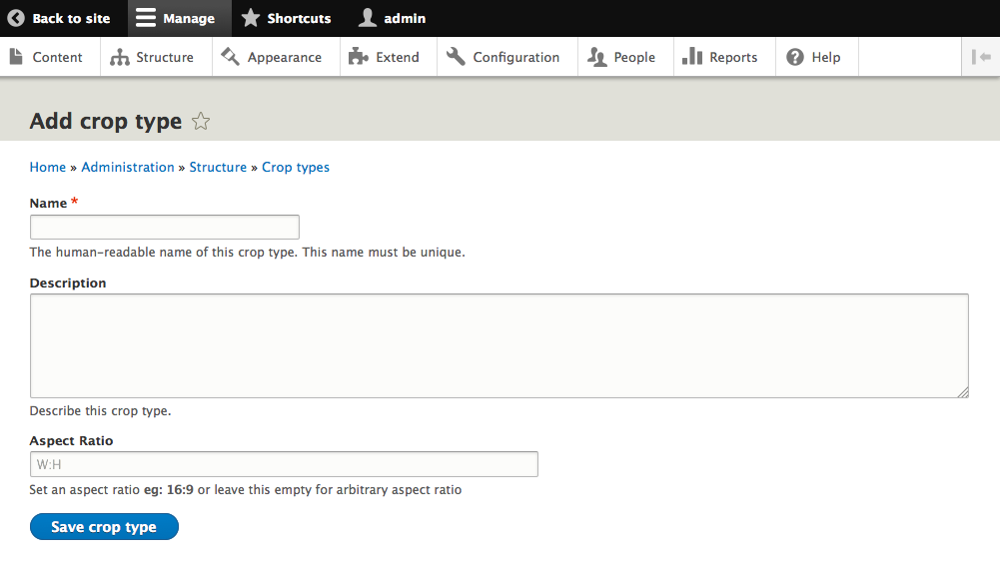
2. Create an Image Style
  * On `admin/structure/config` choose **Image styles**
    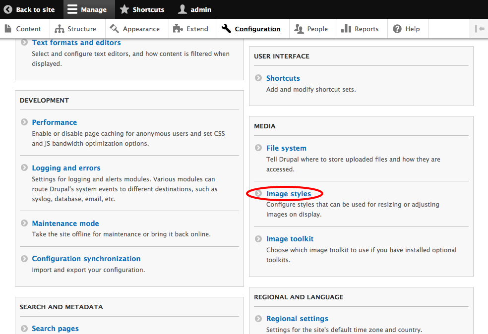
  * Click on **+ Add image style**
    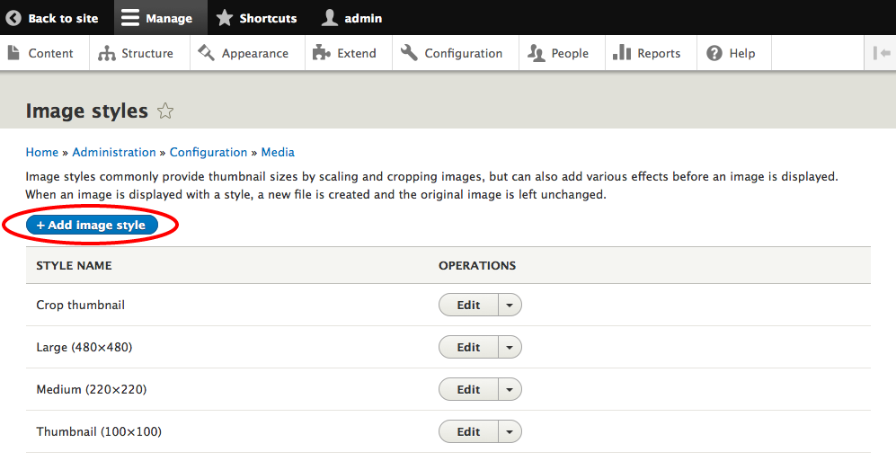
  * Add Image style name and click **Create new style**
    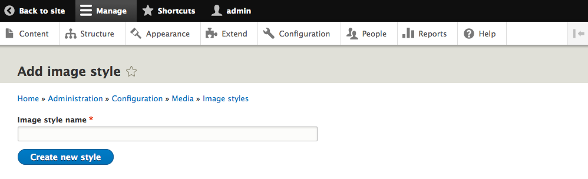
  * Choose Manual crop effect and click **Add**
    
  * Choose your Crop Type, to apply your crop selection, and click **Add effect**
    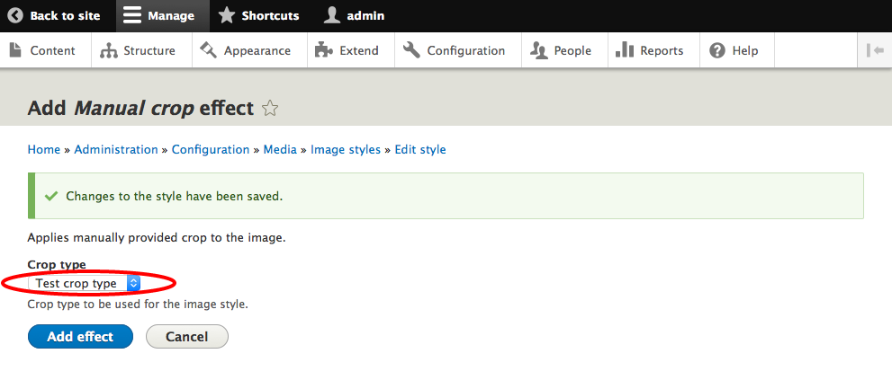
3. Create an Image field
  * On desired content type (i.e. Basic page), on `admin/structure/types`, click on **Manage fields**
    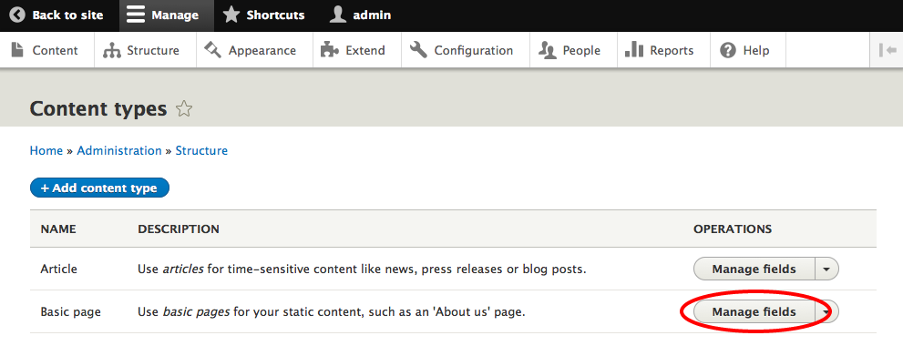
  * Click on **+ Add field**
    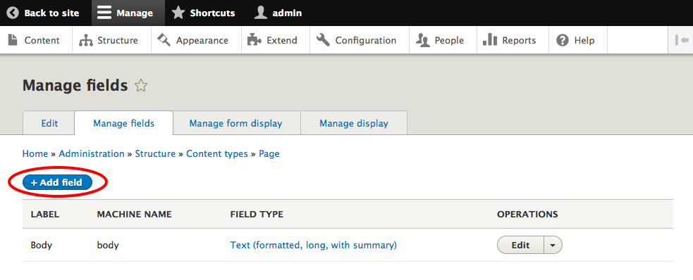
  * Choose **Image**, add label and click **Save and continue**
    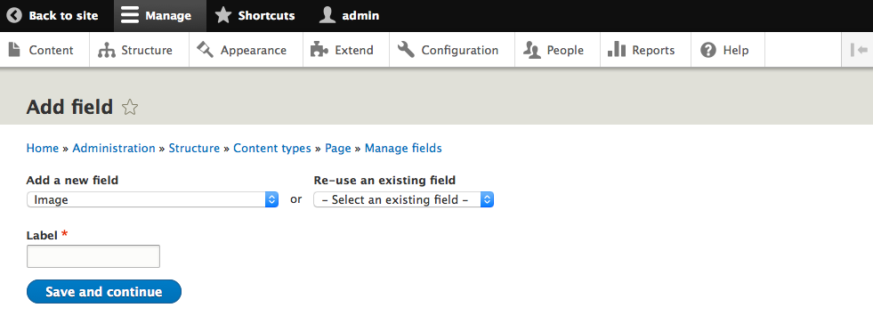
4. In form display of your page, on `admin/structure/types/manage/page/form-display`, set the widget for your field to ImageWidgetCrop
  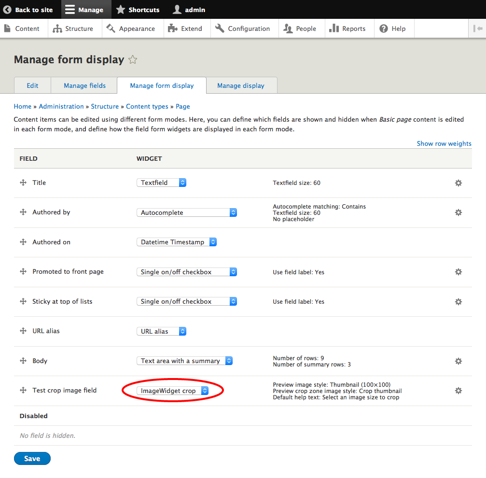
  and select your crop types in the Crop settings list and click **Update** and then **Save**. You can configure the widget to create different crops on each crop types. For example, if you have an editorial site, you need to display an image on different places. With this option, you can set an optimal crop zone for each of the image styles applied to the image.
  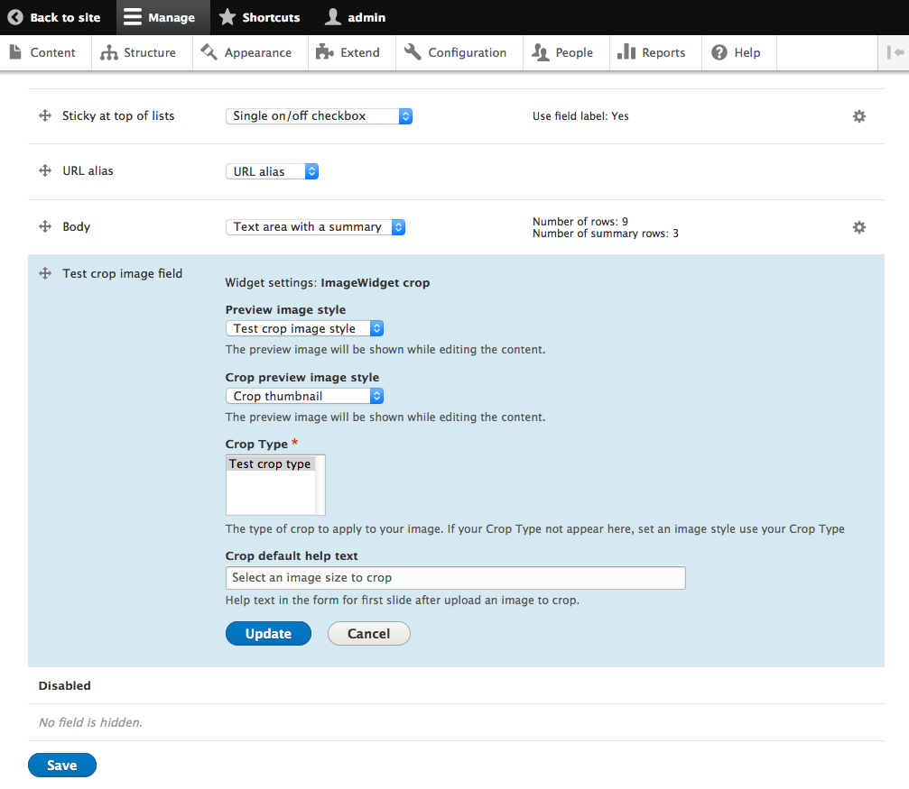
5. On Manage display of your page, on `admin/structure/types/manage/page/display`, set the display formatter Image
  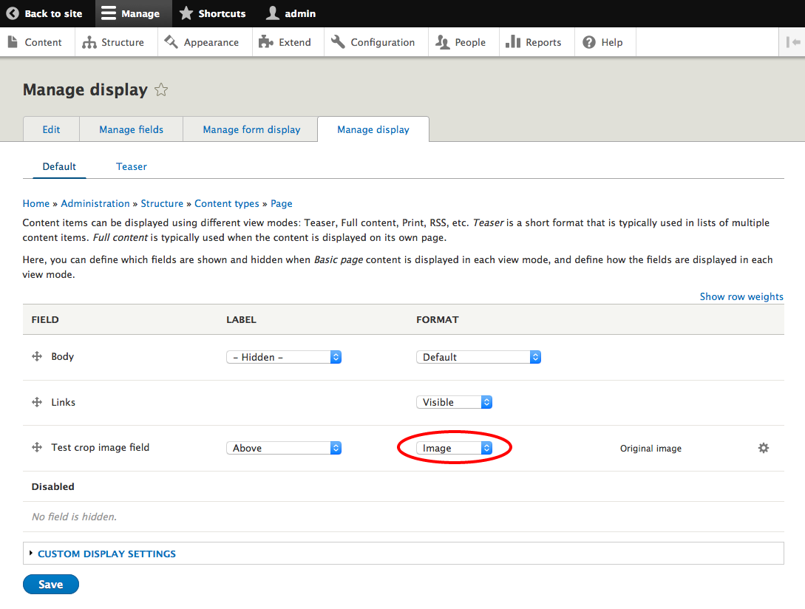
  and choose your image style and click **Update** and then **Save**
  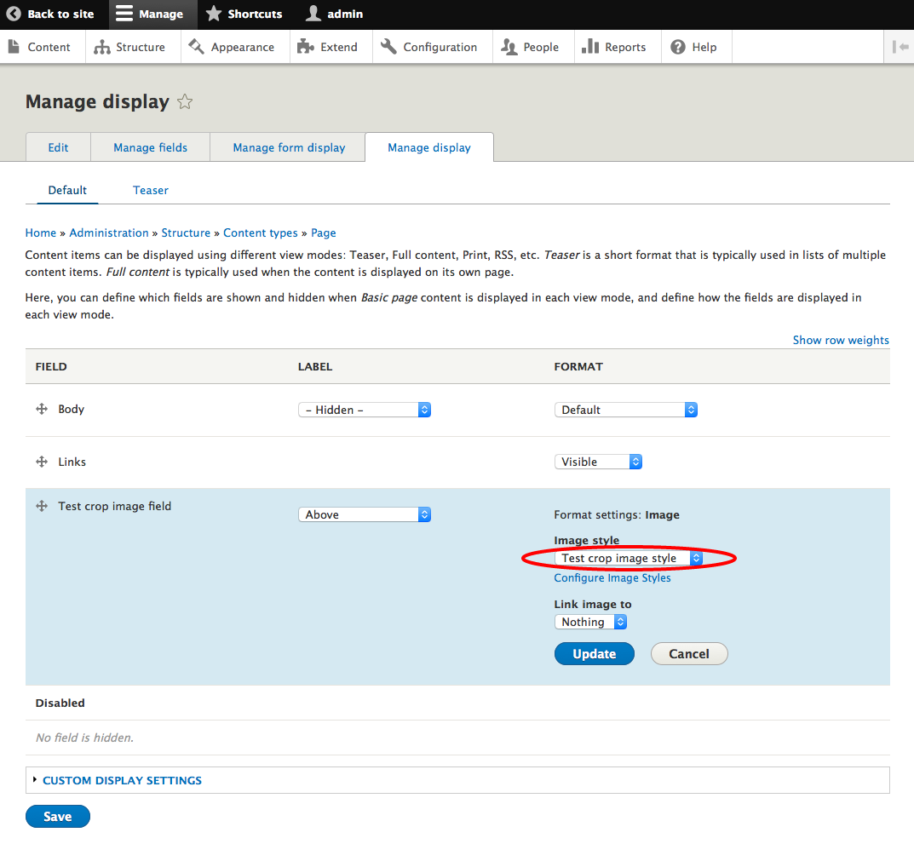
6. Add an image with your widget to your content and crop your picture, by crop types used for this image
  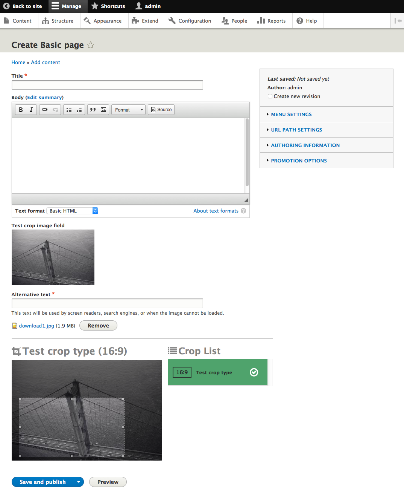
  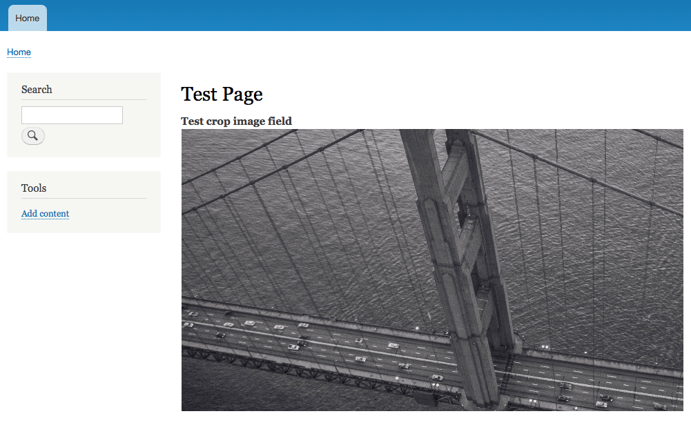
  
## ImageWidgetCrop Code Quality

* [SensioLabsInsight](https://insight.sensiolabs.com/projects/0e2f44af-6837-4772-b3e0-c373faa95ae6)
* [Scrutinizer](https://scrutinizer-ci.com/g/woprrr/image_widget_crop/?branch=8.x-1.x)
* [Travis-ci](https://travis-ci.org/woprrr/image_widget_crop)
