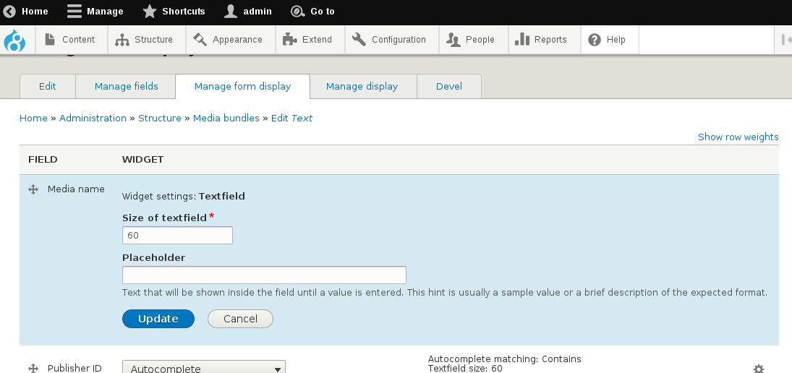

## Using the "automatic name" functionality for your media entities

As with any entity in drupal, all media entities need to have a human-readable label attached to each instance created. The media_entity module autommatically creates a base-field for this, called "Media name".

If you want your editors to be able to input / edit this value manually on each entity, you don't need to do anything, aside from probably configuring some of the field widget settings on the form, such as textfield size, placeholder, etc. These settings can be configured at the URL: ``` admin/structure/media/manage/{your-bundle-name}/form-display ```



On the other hand, if you do not want to expose this to be created / modified for each entity, the module provides an "**automatic label**" functionality. This actually happens each time a media entity is being saved without a manual value introduced. In order to take advantage of this, just disable / hide the name field from the entity form configuration (on the same URL indicated above), and your entities will be created with a default name / label.

Note that each type provider (media bundle) is requested to provide a sensible default name, according to each media type characteristics. For example, the "image" type provider will probably provide a default name based on the image filename, or the "twitter" bundle will provide a default name based on the tweet's author / tweet ID.

If the provider type does not indicate any bundle-specific name to be used as default and a media
entity is created without name, the media_entity module will use the following pattern:
  ``` media:{bundle_name}:{uuid} ```
