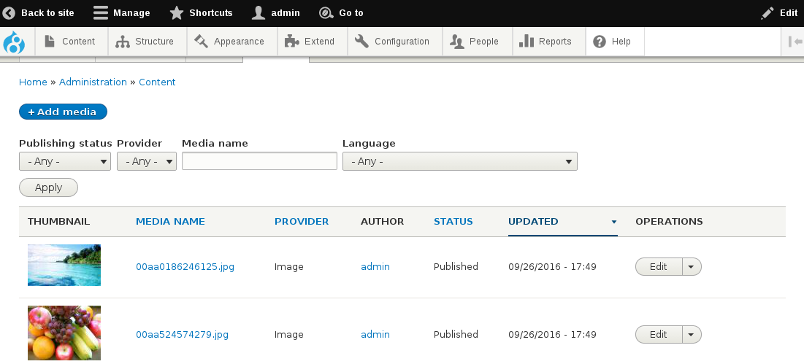

# Basic usage


## Creating media items manually

In order to manually create some media entities go to ``` /media/add ``` and choose the bundle you are interested in.

You will then see the entity form, as defined in ``` /admin/structure/media/manage/{bundle-name}/form-display ```. Fill up all the fields and save the entity.


## Using the pre-defined media gallery

The **Media entity** module comes with a pre-defined list of media items created on your site. You can find it on the URL ``` /admin/content/media ```.



Like many other administrative lists of content on your site, this page is a view and can be modified going to the Views administration page, under Structure -> Views.


