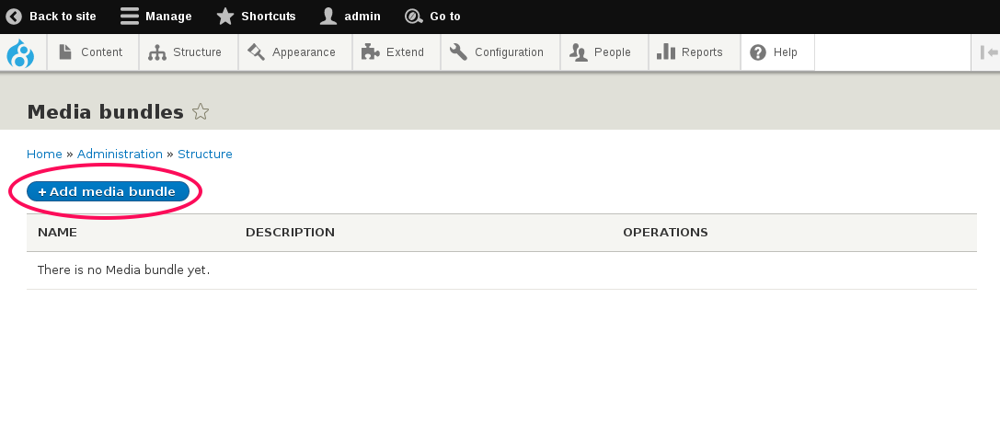
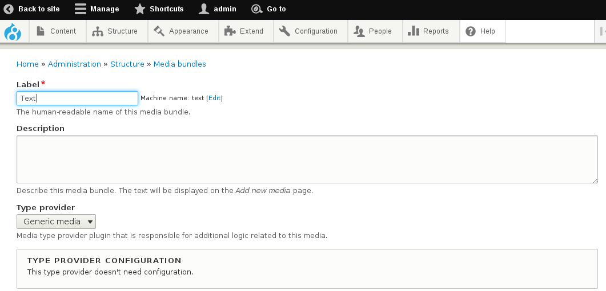
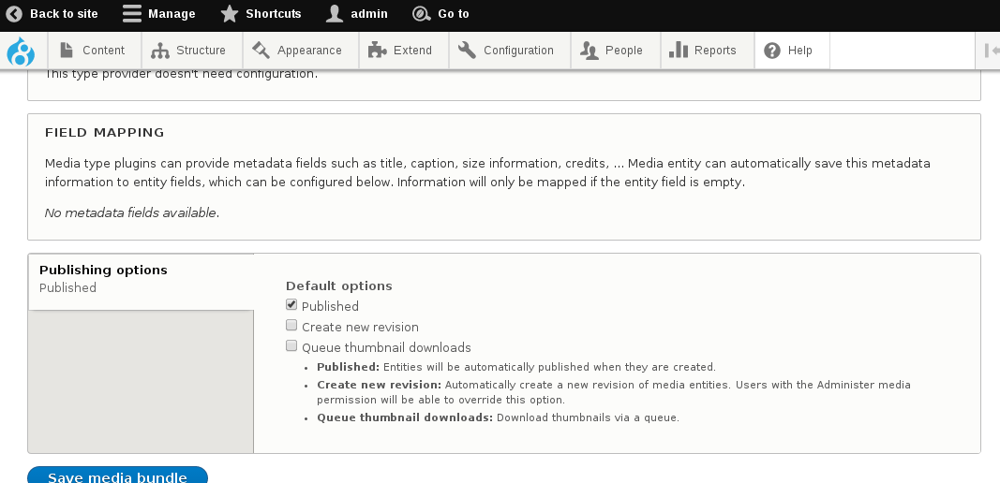
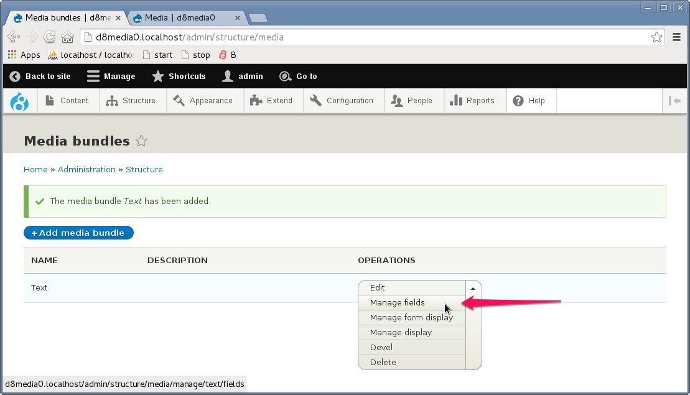
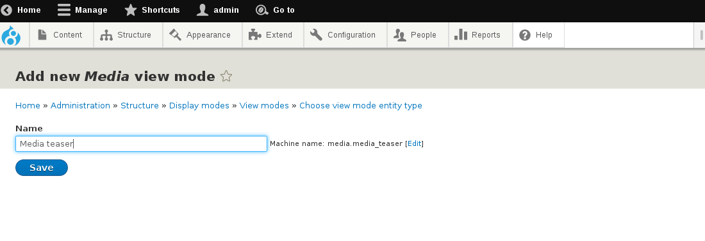
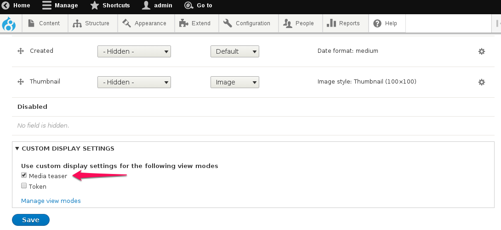

# Installation and Configuration

- Install the module as any other drupal module
- Once installed, go to Structure -> Media bundles (url: ``` admin/structure/media ```) and click on "**Add media bundle**" to create a new media bundle.



NOTE: if you have not installed any other [provider module](type_providers.md) yet, the only bundle you will be able to create is the "**Generic media**" bundle, with no media-specific functionality.

- Give your bundle a name, configure the extra settings on the bottom, and click "**Save media bundle**"





- Once created, you can now use your bundle as if it were a new "content type", adding fields to it, managing the form or the view display, etc.



## Create a new viewmode

As with any other entity in drupal, when it comes to render the rendering it in different contexts, you might want to have specific viewmodes / form modes available.

To create a new viewmode, go to Structure -> Display modes -> View modes -> Add new view mode (or visit the URL: ``` /admin/structure/display-modes/view/add ``` )

Select "Media" and then give a name to your new viewmode.



Go back to Structure -> Media bundles, select "**Manage display**" on your custom bundle, and then make sure you enable the new viewmode in "Custom display settings", at the bottom of the page, and click "Save".



## Using the "automatic name" functionality for your media entities

As with any entity in drupal, all media entities need to have a human-readable label attached to each instance created. The media_entity module autommatically creates a base-field for this, called "Media name".

If you want your editors to be able to input / edit this value manually on each entity, you don't need to do anything, aside from probably configuring some of the field widget settings on the form, such as textfield size, placeholder, etc. These settings can be configured at the URL: ``` admin/structure/media/manage/{your-bundle-name}/form-display ```


On the other hand, if you do not want to expose this to be created / modified for each entity, the module provides an "**automatic label**" functionality. This actually happens each time a media entity is being saved without a manual value introduced. In order to take advantage of this, just disable / hide the name field from the entity form configuration (on the same URL indicated above), and your entities will be created with a default name / label.

Note that each type provider (media bundle) is requested to provide a sensible default name, according to each media type characteristics. For example, the "image" type provider will probably provide a default name based on the image filename, or the "twitter" bundle will provide a default name based on the tweet's author / tweet ID.

If the provider type does not indicate any bundle-specific name to be used as default and a media
entity is created without name, the media_entity module will use the following pattern:
  ``` media:{bundle_name}:{uuid} ```


## Bundle settings specific to each provider

Please note that each provider will probably allow you to define some bundle-specific settings, such as a source field for your media, some metadata mapping to some custom fields, etc. You will find more information about the provider-specific settings on each submodule's chapter on this manual.
