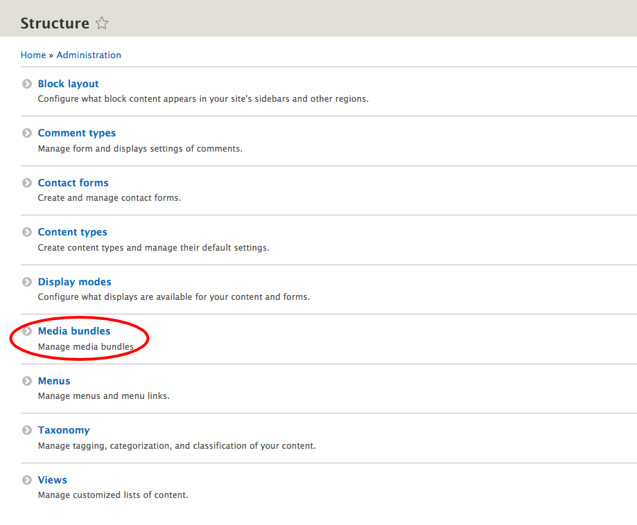
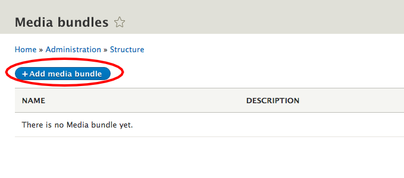
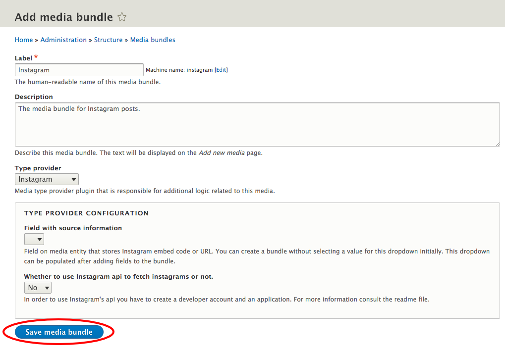

## Creating a Media bundle
  * On `admin/structure` choose **Media bundles**.

    
  * Click on **+ Add media bundle**.

    
  * Fill *Label*, *Description* and *Type provider fields* for your media bundle and click **Save media bundle**.

  NOTE: if you have not installed any other [provider module](type_providers.md) yet, the only bundle you will be able to create is the "**Generic media**" bundle, with no media-specific functionality.

    

  * Once created, you can use your bundle as if it were a new "content type", adding fields to it, managing the form or the view display, etc.

  ## Bundle settings specific to each provider

  Please note that each provider will probably allow you to define some bundle-specific settings, such as a source field for your media, some metadata mapping to some custom fields, etc. You will find more information about the provider-specific settings on each submodule's chapter on this manual.
