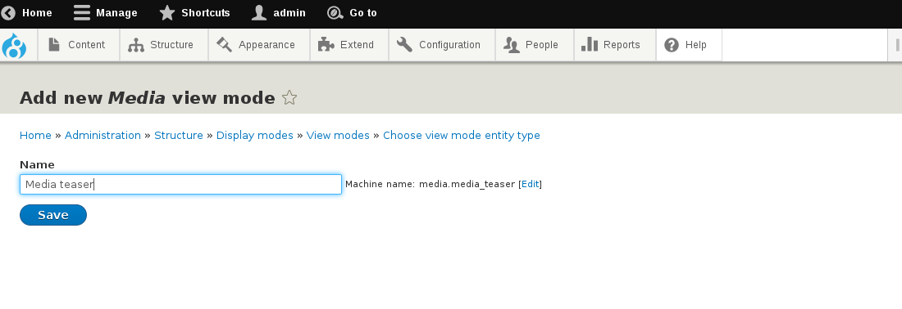
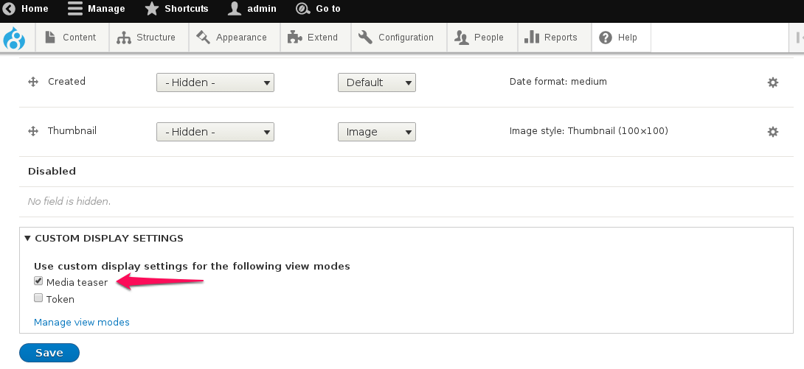

# Creating a new viewmode

As with any other entity in drupal, when it comes to render the rendering it in different contexts, you might want to have specific viewmodes / form modes available.

To create a new viewmode, go to Structure -> Display modes -> View modes -> Add new view mode (or visit the URL: ``` /admin/structure/display-modes/view/add ``` )

Select "Media" and then give a name to your new viewmode.



Go back to Structure -> Media bundles, select "**Manage display**" on your custom bundle, and then make sure you enable the new viewmode in "Custom display settings", at the bottom of the page, and click "Save".


