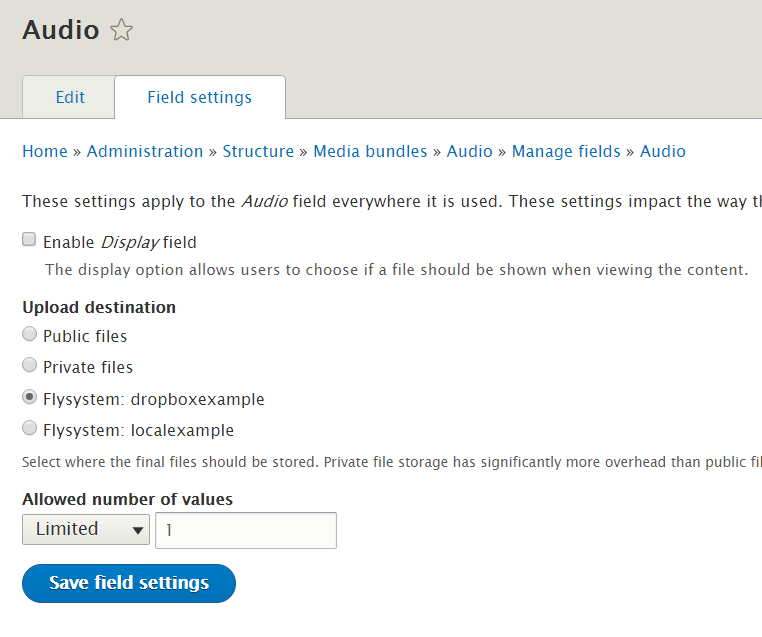

Remote storage for media in Drupal
====================

Why remote storage
---------------------------------
Drupal modules like media_entity and file_entity catalog your media, and keep information about it inside Drupal. But in most cases, they aren't the actual media themselves. Commonly, the actual media are files stored on a server, not entities in Drupal's database. Media_entity and file_entity offer fieldable entities, to which a 'file' field is usually added which stores the location of the file and thereby enables Drupal to serve it up to your website's visitor.

In the simplest scenario, the files live on your webserver, and Drupal's core 'file' field type can both upload them and serve them up. However, large collections of media files (especially audio or video) can take up a huge amount of storage space - 30 hours of video might need a Terabyte of storage. Storing a Terabyte on a webserver is very expensive (if you could even find a web host that offered it). This is because web hosting servers are optimised for fast response to page requests, while for simple file storage there are cheaper alternatives. Most people with large media collections therefore usually choose to store them off their webserver at a more cost-effective location, such as a cheaper server or a cloud storage service like Amazon S3.

In D7
------------------------
In Drupal 7,  modules like [Storage API] (https://www.drupal.org/project/storage_api), [AmazonS3] (https://www.drupal.org/project/amazons3) and [S3FileSystem] (https://www.drupal.org/project/s3fs) assisted with integrating these remotely stored files with Drupal. So far, none of these older modules have been ported to Drupal 8.

Flysystem
---------------------------------------
The [Flysystem] (https//www.drupal.org/project/flysystem) module is the first remote storage solution to be available for Drupal 8 (and it's also recently available in D7). It uses the [Flysystem PHP library] (http://flysystem.thephpleague.com/), a modern filesystem abstraction designed to allow for the easy swapping of one filesystem with another. The Flysystem library is gaining widespread adoption in the PHP world, and is the default filesystem layer in the Laravel framework. Incorporating it in a Drupal project is an example of the "getting off the island" or "proudly invented elsewhere" philosophies often discussed for Drupal 8 - making use of the work done in the wider PHP community rather than struggling to reinvent everything from scratch.

Flysystem is made available in Drupal 8 by the [Flysystem module] (https//www.drupal.org/project/flysystem). Currently through its adapter modules it offers the following storage types:
* Local
* (s)FTP
* ZIP
* Dropbox
* Rackspace
* Amazon S3
It's relatively easy to implement new adapters, and more are becoming available all the time.

When joined with a flysystem adapter module, the flysystem module offers four things:
* a syntax to define the access details for the remote storage location in Drupal's settings.php. 
* a storage setting for Drupal's core file field.
* access to the Flysystem API so you can execute standard file system operations (read, write, list, etc.) on your remote storage from your custom code.
* a synchronisation UI that enables you to manually synchronise local and remote storage locations.

Simple remote storage with Flysystem
-------------------------------------------------------------
* Install Flysystem module and an adapter module e.g. Flysystem_dropbox

* Specify remote storage location in Drupal's settings.php

    $schemes = [
        'dropboxexample' => [
            'driver' => 'dropbox',
            'config' => [
               'token' => '#my-dropbox-token#',
               'client_id' => #my-dropbox-email-id#,
               'prefix' => '[/dropbox subdirectory]', // Optional.
            ],
        ],
    ]
    $settings['flysystem'] = $schemes;

* Choose Flysystem location as the storage for a Drupal file field

If you upload a file in Drupal using that file field, it will then be stored on your remote location, not on the web server where Drupal runs.

When the file field is rendered by Drupal (e.g. because the content or media entity having that file field is requested by a site visitor) then the file will be served up to your visitor, exactly as if it were stored on your server. All the Drupal field formatters, theming, etc. work exactly as normal.

Flysystem's file access control
--------------------------------------------------
Flysystem storage schemes works like private files in drupal 8.

It hides the actual link of the to file and delivers it via a Drupal generated path. Thus it restricts access to the original files and let other modules provide access control to the file. 

By default when using a file field, anyone who can access the entity to which the file field is attached will be able to access the file at its URL. If they logout or have their permissions changed, they won't be able to access the file even if they made a copy of its URL.

The situation is slightly more complicated with images - [see here for more] (https://www.drupal.org/node/2541116).

Bandwidth
---------------------------------------------
One issue to be aware of with Flysystem is that as it is not handing out a direct URL to the third party server, your web server is still involved in each request, and so there may be bandwidth or traffic implications for your web server if you serve up a lot of media.
@Todo: better information on this matter.
